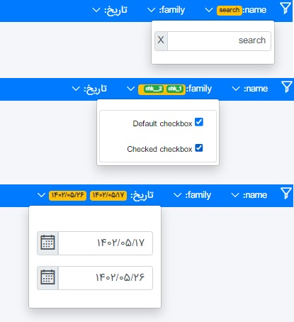

# Redmask.Taghelpers 

## Description
Some useful UI taghelpers  
source code and sample : https://github.com/vahidarya14/Redmask.Taghelpers2

#### sample usage source:

add this in head of site
```csharp
     @Html.RedmaskCss(new CssPool().Bootstrap5().PersianDateTimePickerBs5().Kendo2020().AdminLTE().TagInput().PersianCss())
   <script src="~/_content/Redmask.Taghelpers/lib/jquery/jquery.min.js"></script>
```
and this in footer (or header)
```csharp
    @Html.RedmaskJs(new ScriptsPool().Bootstrap5().PersianDateTimePickerBs5().Kendo2020().AdminLTE().TinyMCE5().TagInput())

```
 add ``` @addTagHelper *,Redmask.Taghelpers ``` to **_ViewImport.cshtml**

Done

>[!NOTE]
>_you can ignore **PersianDateTimePicker** or **Kendo2020** or **AdminLTE** or **TagInput** or **PersianCss** if you aren't using these component.and just add needed css and js_
> 
# usage

#### imageChooser:
```html
  <imageChooserFor asp-for="Icon" folder-path="@Setting.ContentsFolder" max-kb="1500" img-css="max-height:200px;border:2px solid blue;" ></imageChooserFor>
```


#### TagInput:
```html
   <TagInputFor asp-for="Tags"></TagInputFor>
```


#### PersianDatePicker:
```html
    <PersianDatePickerBs5For asp-for="CreateDate"></PersianDatePickerBs5For>
```


#### TinyMce5
```html
  <TinyMce5For asp-for="Description" language="fa_IR" directionality="rtl">some content</TinyMce5For>

```


#### Switch
```html
<SwitchFor asp-for="IsActive" label="Is Active"></SwitchFor>
```


#### none binding tagheplers
```html
<filterPanel>
    <dropDownFilterItem title="name" id="nameFilter">    </dropDownFilterItem>
    <customeBobyFilter id="familyFilter" title="family">
        <ol class="list-group list-group-numbered px-0">
            <li class="list-group-item d-flex justify-content-between align-items-start">
                <div class="form-check">
                    <input class="filterInput familyFilter" type="checkbox" data-lbl="chk_1" id="flexCheckDefault">
                    <label class="form-check-label" for="flexCheckDefault">
                        Default checkbox
                    </label>
                </div>
            </li>
            <li class="list-group-item d-flex justify-content-between align-items-start">
                <div class="form-check">
                    <input class="filterInput familyFilter" type="checkbox" data-lbl="chk__2" id="flexCheckChecked">
                    <label class="form-check-label" for="flexCheckChecked">
                        Checked checkbox
                    </label>
                </div>
            </li>
        </ol>
    </customeBobyFilter>
    <filterItem>
        <filterBadge>
            تاریخ:
            <span class="badge badge-warning" id="dateFromFilter2-has"></span>
            <span class="badge badge-warning" id="dateToFilter2-has"></span>
            <i class="las la-angle-down"></i>
        </filterBadge>
        <filterBody>
            <div class="p-2 pt-4">
                <PersianDatePickerBs5 class="filterInput" id="dateFromFilter"></PersianDatePickerBs5>
                <PersianDatePickerBs5 class="filterInput" id="dateToFilter"></PersianDatePickerBs5>
            </div>
        </filterBody>
    </filterItem>
</filterPanel>
```


```html
<imageChooser name="aa"  ></imageChooser>
<PersianDatePickerBs5 id="picker1" ></PersianDatePickerBs5>
<ShareBtn ></ShareBtn>
```
